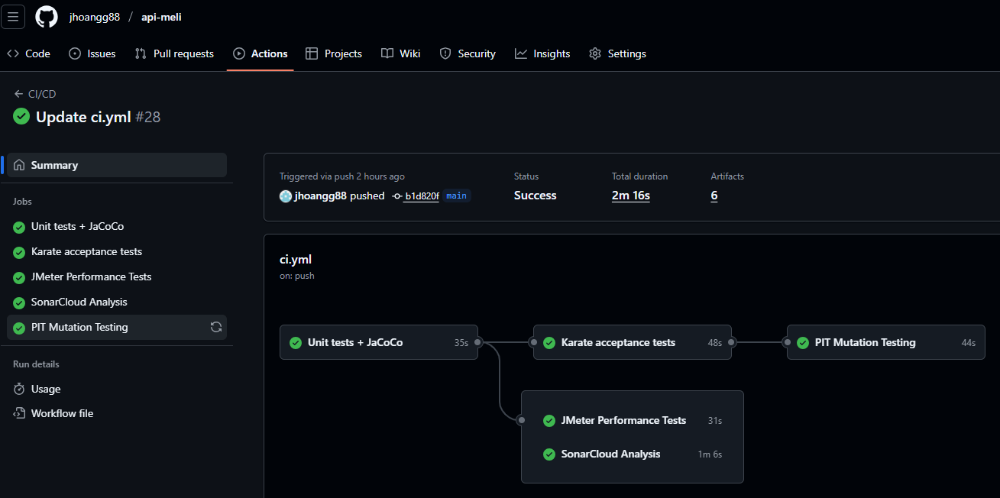

# API Meli - Item Detail

This project implements a backend API inspired by MercadoLibre to provide **product detail information**.  
The solution focuses on clean backend design, error handling, testing, and CI/CD best practices.

---

## 🚀 Objective
Build a backend API that serves product details to be consumed by a frontend.  
All data persistence is handled with local JSON files (no real databases).

---

## 🛠️ Tech Stack
- **Java 17**
- **Spring Boot 3.x**
- **Maven Wrapper**
- **Persistence**: Local JSON files
- **Testing**:
    - Unit tests (JUnit + Mockito)
    - Mutation testing (PIT)
    - Acceptance tests (Karate)
    - Performance tests (JMeter 5.6.3)
- **Code Quality**: SonarCloud (0 code smells)
- **CI/CD**: GitHub Actions

---

## 📂 Architecture
- **domain** → Business models (`Product`, `Price`, `Picture`).
- **infrastructure.repository** → Repository layer (reads from JSON).
- **domain.services** → Business logic (fetching product details).
- **infrastructure.controller** → REST API endpoints.
- **exceptions** → Centralized exception handling (`GlobalExceptionHandler`).

---

## 📡 API Endpoints

### Get product by ID 

**Example request:**
/api/v1/products/P001

**Example response:**
```json
{
  "id": "P001",
  "name": "Bluetooth Headphones XYZ",
  "price": {
    "currency": "COP",
    "amount": 30000,
    "decimals": 0
  },
  "stock": 15,
  "pictures": [
    { "url": "https://meli.com/pic1.jpg" }
  ]
}
```
**Example error response:**
```json
{
  "timestamp": "2025-09-05T17:10:02",
  "status": 404,
  "error": "Not Found",
  "message": "Product not found: NO_EXIST",
  "path": "/api/v1/products/NO_EXIST"
}
```

---
### Get all products

**Example request:**
/api/v1/products

**Example response:**
```json
[
  {
    "id": "P001",
    "name": "Bluetooth Headphones XYZ",
    "price": {
      "currency": "COP",
      "amount": 30000,
      "decimals": 0
    },
    "stock": 15,
    "pictures": [
      { "url": "https://meli.com/pic1.jpg" }
    ]
  },
  {
    "id": "P002",
    "name": "Smartwatch ABC",
    "price": {
      "currency": "USD",
      "amount": 120,
      "decimals": 2
    },
    "stock": 7,
    "pictures": [
      { "url": "https://meli.com/pic2.jpg" }
    ]
  }
]
```

---

## 🧪 Testing
This project includes multiple testing layers to ensure reliability and code quality:

- ✅ **Unit Tests** with JUnit + Mockito
- ✅ **Mutation Testing** with PIT (validates test strength)
- ✅ **Acceptance Tests** with Karate (end-to-end testing)
- ✅ **Performance Tests** with JMeter (SmokeTest - BaseLine - Stress)

---

## ⚙️ CI/CD Pipeline
A complete pipeline is implemented using **GitHub Actions**, running on every push to `main`.

The workflow includes the following stages:
1. Unit tests + JaCoCo coverage
2. Karate acceptance tests
3. PIT mutation testing
4. JMeter performance tests
5. SonarCloud analysis (ensures no code smells)

**Pipeline view:**



---

## ✨ Additional Features (Beyond Requirements)
In addition to the required functionality, the following improvements were implemented:

- **Comprehensive testing**: unit, mutation, acceptance, and performance.
- **Continuous Integration**: automated pipeline with GitHub Actions.
- **Code Quality**: SonarCloud integrated (0 code smells).
- **Version Control**: Project hosted in a public GitHub repository.
- **Clean Architecture**: layered design with separation of concerns.
- **Centralized error handling**: consistent JSON error responses.

---

## 📖 How to Run
See [`run.md`](./run.md) for detailed setup and execution instructions.
